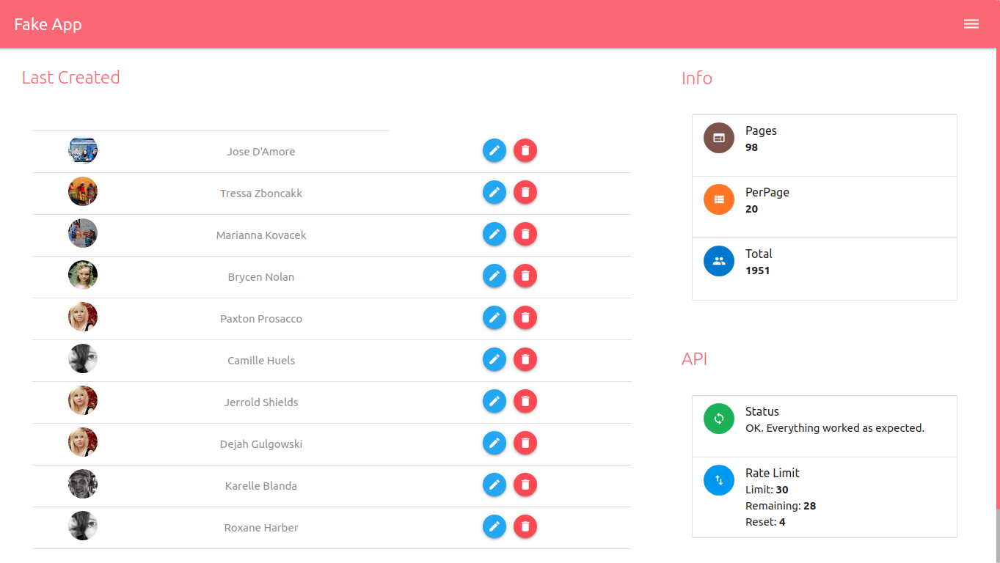
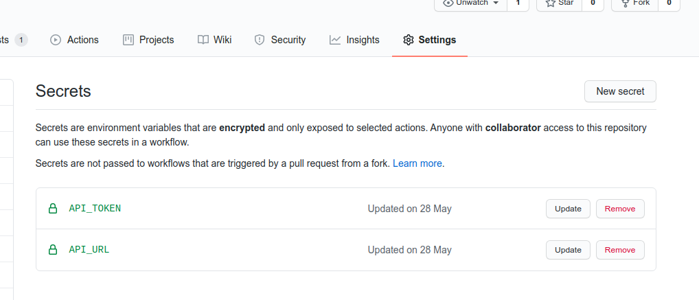

# Fake App 

User Crud Vuejs Test Project for the Front-End Dev Job.

Projeto User Crud Vuejs Teste para a Vaga de Dev Front-End. 

## Demo
[messiasdias.github.io/fake_app](https://messiasdias.github.io/fake_app)




## Project setup

#### Install dependencies
```
npm install
```

#### Run development serve
```
npm run dev
```

#### Compiles and minifies for production
```
npm run build
```

#### Setting .Env File

- Development

Open the .env file at the root of the application and fill in the corresponding values ​​for:
```
VUE_APP_API_TOKEN=api_token_here
VUE_APP_API_URL=https://api-address.api
```

- Deploy on Github pages

Navegate to https://github.com/{user}/{repository}/settings/secrets add the following keys: 
API_TOKEN and API_URL clicking on 'New secret'.

```
API_URL: https://gorest.co.in/public-api
API_TOKEN: <Access_Token>
```

Token must be generated from registration at https://gorest.co.in/user/settings/api-access.html




## API DOC
Documentation and Support: [https://gorest.co.in/](https://gorest.co.in/)
